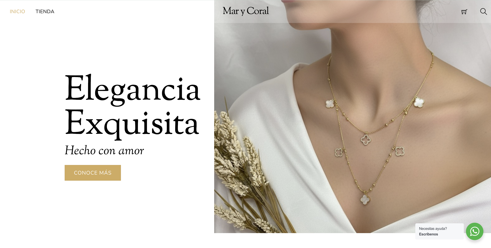
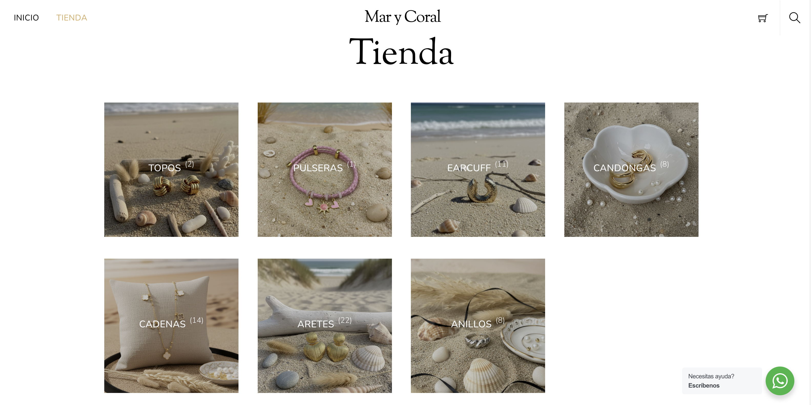

#  💍 Women's Accessories E-Commerce Website

## 📋 Project Overview

A modern, fully-functional e-commerce platform dedicated to women's jewerly, designed to provide an elegant shopping experience with seamless navigation and responsive design across all devices.

## 🔗 Link

🌐 [Live Site Link](https:/https://marycoral.com.co/)

---

## 🛠️ Technical Stack

### **Content Management System**
- **Platform:** WordPress
- **Builder:** Themify Builder
- **Hosting Provider:** HostGator

### **Core Features & Plugins**

| Plugin | Purpose | Key Benefits |
|--------|---------|--------------|
| 🛒 **WooCommerce** | E-commerce functionality | Complete store management, payment processing, inventory control |
| 💬 **WhatsApp** | Customer communication | Direct messaging, instant support, enhanced customer engagement |
| 🌐 **Loco Translate** | Multilingual support | Easy translation management, localization capabilities |

### **AI-Powered Content**
- **Image Generation:** Gemini Nano
  - Used for creating high-quality product visuals
  - AI-generated imagery for enhanced visual appeal

---

## 📱 Website Architecture

### **Main Pages**

#### 🏠 **Home Page**
The welcoming gateway to the store, featuring:
- Hero section 
- Quick navigation to popular categories

#### 🛍️ **Store**
Central shopping hub displaying:
- Complete product catalog
- Grid view options
- Quick view functionality

#### 🔍 **Products Filter by Category**
Organized browsing experience:
- Categorized product listings
- Easy navigation between categories
- Category-specific filters
- Streamlined product discovery

#### 🛒 **Cart**
Comprehensive shopping cart featuring:
- Product quantity adjustment
- Real-time price calculations
- Coupon code application
- Continue shopping option
- Proceed to checkout 

#### ✅ **Checkout**
Secure payment processing page with:
- Billing information form
- Shipping details collection
- Payment method selection
- Order summary review

---

### 🖥️ Desktop View

- Homepage with  banner
- Products page with filters
- Product detail page

### 📲 Mobile View

- Responsive navigation
- Mobile-optimized catalog
- WhatsApp icon

---

## 🎯 Key Features

### **Search Functionality** 🔎
- Powerful product search engine
- Real-time search results
- Filter integration with search

### **Responsive Design** 📱💻
- Fully mobile-optimized
- Desktop-enhanced experience
- Consistent UI across all screen sizes
- Touch-friendly navigation elements

### **Product Filtering** 🎚️
- Category-based filtering
- Price range selection
- Color options
- Size availability

---

## 📞 Customer Support

**WhatsApp Integration:** Direct messaging for instant support  
**Response Time:** Real-time customer engagement  

---

## 📝 Development Notes

This project demonstrates my ability to:
- Work with WordPress and professional page builders
- Create intuitive user experiences
- Implement filtering and search functionalities
- Design fully responsive websites
- Manage multimedia content (product images)
- Integrate communication systems (WhatsApp Plugin)

---

👨‍💻 **Developed by:** Ashley Sanchez  
📧 **Email:** ashleymsanchez05@gmail.com  
💼 **GitHub:** [@ashleymichelle5](https://github.com/ashleymichelle5)  
⚙️ **Main Technology:** WordPress + Themify Builder  
📅 **Year:** 2025

---